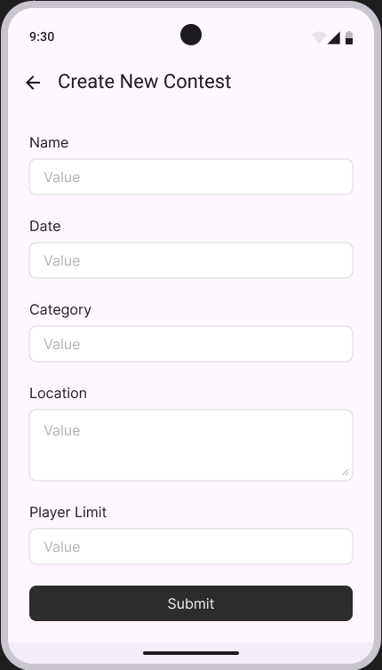
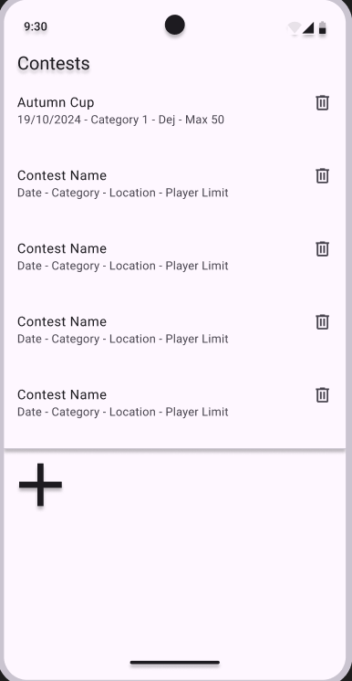

My app hosts sports contests. On the main window I want to see a vertical list of all the contests. I want to be able to add a new contest by clicking a plus sign on the bottom of the screen, update the details of an existing one by clicking a pen icon or delete one from the list by clicking a trash can icon.

A contest should have the following information: 
Name - Contest Name.
Category - Number between 1 and 4 including.
Location - Location of the contest.
Date - Date of contest.
Player Limit - The limit of players who can compete.

Create Contest: Add Contest clicked, new window opens up where you input valid information for all the five fields and add it to the list.
Read Contest: All the details will be visible on the main window. When showing its players, only show the contest's name.
Update Contest: Click the specific contest's update button, new window opens up where you input valid information for the fields you want to update.
Delete Contest: Click the specific contest's delete button, it is removed from the list.

Every crud operation will be persisted in the database.

If the device goes offline:
The local list of items will still be shown. The user will be notified that there is no connection. Creating an item will be done locally until the connection comes back online, at which point the data will be sent to the server. Update and delete will not work while offline.

